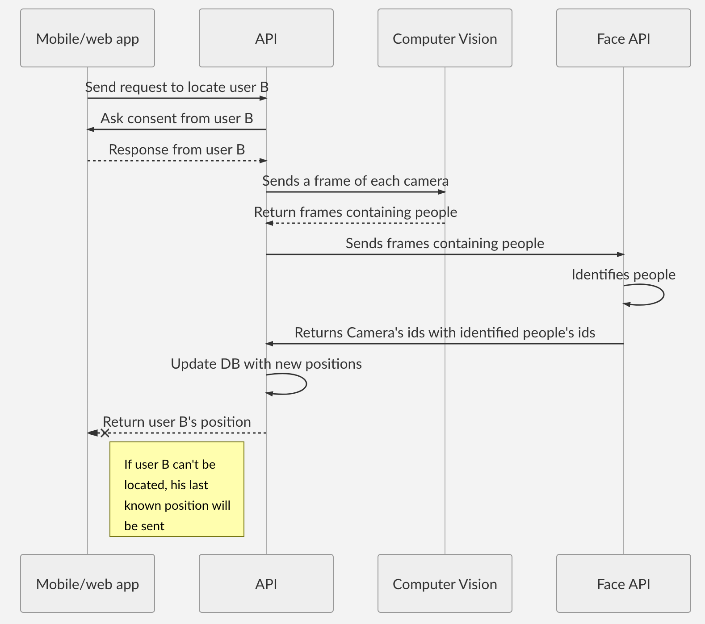

# Little Sister

Little Sister is an open-source project developed during the 2018 edition of the **TechOffice Hackathon** from the *Microsoft Innovation Center* in Mons. 

### Project members

[Nathan Pire](https://github.com/thelittlewozniak)
[Massimo Gentile](https://github.com/MassimoGentile)
[Simon Gauthier](https://github.com/GausiVagos)
[Xavier Vercruysse](https://github.com/xvercruysse)

## Description

Little Sister is an app whose aim is to minimise the time spent searching someone in a large company.
Every 5 minutes, a frame from each of the connected cameras will be captured and analysed using *Microsoft*'s **Face API** and **Computer Vision API**.
Each user identified by **Face API** will then be updated with the new position.
When an user asks for the location of another user, this other user will be sent a notification asking for his consent. If he approves, an immediate scan will be made, and his position will be returned to the asking user.
If he refuses, the first user will be informed and he will not be able to see the position of the other user.

### UML diagram

# License

See [Licence](https://github.com/xvercruysse/Little-Sister)
